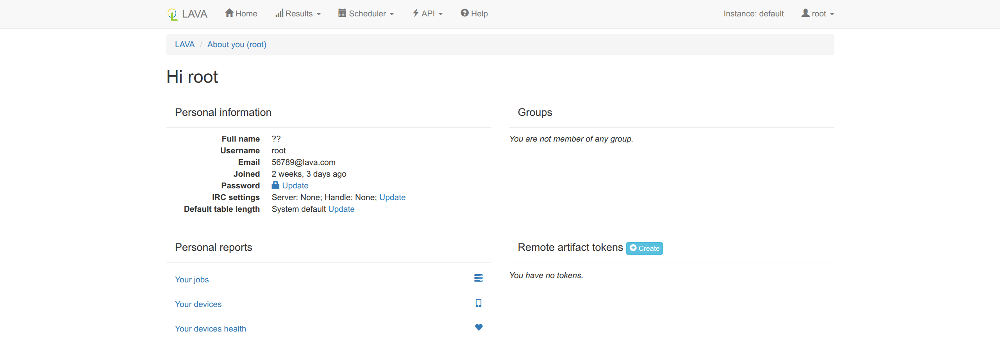
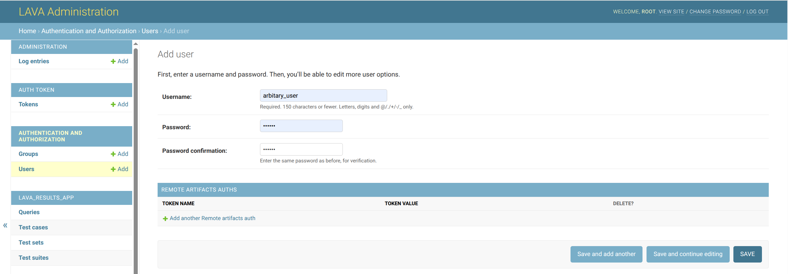
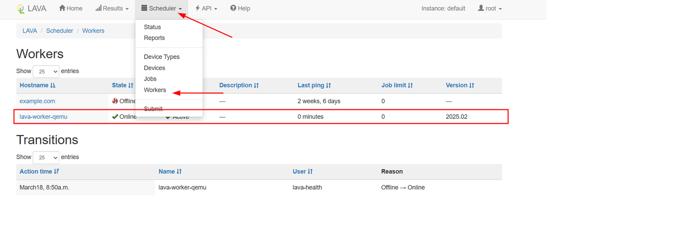

# LAVA 主/从机部署文档

## 主机部署

> 参照 Linaro 官方部署文档： [Start small](https://docs.lavasoftware.org/lava/simple-admin.html#simple-admin-small)， [Installing on Debian](https://validation.linaro.org/static/docs/v2/installing_on_debian.html#debian-installation)， [First Steps installing LAVA](https://validation.linaro.org/static/docs/v2/first-installation.html#installation)，[Setting up a LAVA Instance](https://docs.lavasoftware.org/lava/pipeline-server.html)

## LAVA 在 Debian 各个发行版上的支持

## 部署 Server（Master）

### 申请 server 虚拟机（需要线下协助）

上述支持中最新为版本 12.x，故这里使用 Debian 12（Bookworm）虚拟机，后续服务端的配置与示例都在此虚拟机中进行。

### 添加 LAVA 仓库链接

> ICYMI,the following links are meant to be added into \`/etc/apt/sources.list\` or equivalent files

相关仓库链接：

* Release: `deb `​`https://apt.lavasoftware.org/release`​` bookworm main`
  * Remark: 只包含 amd64 与 arm64 包
* 每日构建： `deb `​`https://apt.lavasoftware.org/daily`​` bookworm main`
  * Remark: 跟 snapshot 内容相同

使用仓库链接可以使用最新版的 LAVA，参照官网内容添加以下密钥与 Repo 即可

```Bash
sudo apt install curl gpg     # just in case you don't have them installed yet
curl -fsSL "https://apt.lavasoftware.org/lavasoftware.key.asc" | gpg --dearmor > lavasoftware.gpg
sudo mv lavasoftware.gpg /usr/share/keyrings
sudo chmod u=rw,g=r,o=r /usr/share/keyrings/lavasoftware.gpg

echo 'deb [signed-by=/usr/share/keyrings/lavasoftware.gpg] https://apt.lavasoftware.org/release bookworm main' | sudo tee /etc/apt/sources.list.d/lavasoftware.list
```

若要安装指定版本的 lava ，需要将最后一句代码修改为：

```Bash
echo 'deb [signed-by=/usr/share/keyrings/lavasoftware.gpg] https://apt.lavasoftware.org/archive/VERSION bookworm main' | sudo tee /etc/apt/sources.list.d/lavasoftware.list
```

并将其中的 `VERSION` 修改为指定版本，如：

```Bash
echo 'deb [signed-by=/usr/share/keyrings/lavasoftware.gpg] https://apt.lavasoftware.org/archive/2025.04 bookworm main' | sudo tee /etc/apt/sources.list.d/lavasoftware.list
```

集群式部署，参照`Single-Master Instance Installation`与`Pipeline Installation`

> * The master needs the `lava-server` package installed, just as on a [Single Master Instance installation](https://validation.linaro.org/static/docs/v2/first-installation.html#single-instance).
> * A worker only needs the `lava-dispatcher` package installed

### 安装服务端

> 从依赖可见其需要安装 PostgreSQL， 网页反向代理服务器也需要自行安装，LAVA 自带一份 Apache2 的配置文件
> 
> 建议手动按需安装 LAVA 推荐的软件包，参照下方指令来避免自动安装推荐软件包
> 
> 因为 LAVA 安装时会自动配置 PSQL，所以先安装

`sudo apt install postgresql`

`sudo apt install lava-server`

> 截至 2025.02.25，如果不添加 LAVA 源，此命令将会安装 lava-server:2023.01-2 版本，该文档默认添加 LAVA 源，安装最新版本

### 配置服务端

其提供的 Apache2 配置文件自动放置在`/etc/apache2/sites-available/lava-server.conf`

可以使用以下命令来启用 lava 的 apache2 配置：

```Bash
sudo a2dissite 000-default
sudo a2enmod proxy
sudo a2enmod proxy_http
sudo a2ensite lava-server.conf
sudo service apache2 restart
```

或者，如果你是个 Nginx 爱好者，依照其配置转述，如下是 Nginx 版本的配置文件

```Nginx
server {
    listen 9600 default_server;
    listen [::]:9600 default_server;
    # include snippets/snakeoil.conf;
    
    root /usr/share/lava-server/static/lava_server;
    location /tmp/ {
        # 全量安装自带 dispatcher
        alias /var/lib/lava/dispatcher/tmp;
    }

    location /ws/ {
        proxy_pass http://127.0.0.1:8001/ws;
        proxy_http_version 1.1;
        proxy_set_header Upgrade $http_upgrade;
        proxy_set_header Connection "upgrade";
        proxy_read_timeout 86400;
    }

    index index.html index.htm;
    server_name _;

    location / {
        proxy_pass http://127.0.0.1:8000/;
    }
}
```

#### Master 包含内容

* 网页操作界面，
* 数据库，常用 postgresql
* 调度器，
* HTTP 服务器，使用 gunicorn

重启这些服务可以使用

```Shell
service lava-server-gunicorn restart
service lava-publisher restart
service lava-scheduler restart
```

此时管理页面应该可以从`http://localhost`（不在 server 本机则为 `http://serverip`  如果你使用的是 NGINX 版本，记得手动添加端口）访问，并且可以从`http://localhost/RPC2` (`http://serverip/`​`RPC2`)访问 XML-RPC，后续将会用到。

如果访问 LAVA 的 URL 没有被 SSL 保护（访问时不是以 http**s**​**​ ​**开头），

那么需要在`/etc/lava-server/settings.conf`中添加 **外部可访问地址** ，并将`CSRF_COOKIE_SECURE` 与 `SESSION_COOKIE_SECURE` 的设置改为 `False`，不然将会**无法在非 ​**​**HTTPS**​**​ 下登录**

```JSON
{
    "ALLOWED_HOSTS": ["<外部可访问地址>", "127.0.0.1", "[::1]", "localhost"],
    "SESSION_COOKIE_SECURE": false,
    "CSRF_COOKIE_SECURE": false
}
```

### 创建超级用户

`lava-server manage createsuperuser --username [用户名] --email=[任意长得像邮箱的地址]`

此时会提醒设置密码，记得妥善保管， 如有需要，可以使用如下命令，用于将 LAVA 系统的本地用户与 LDAP 目录服务中的用户账号进行关联绑定。绑定后用户可通过 LDAP 凭证登录 LAVA 系统，同时保留原有本地用户的权限配置，实现集中化身份认证

`lava-server manage mergeldapuser --lava-user [用户名] --ldap-user [LDAP用户名]`

对于后续的用户提升超级用户权限，可以使用

`lava-server manage authorize_superuser --username [用户名]`

此时点击右上角的登录界面，输入用户名与密码，登录即可




现在你可以：

* 查看已经支持的开发板
  > lava-server manage device-types list --all

### 添加一个普通用户



在网页界面登录用户，并添加一个 Auth Token（认证令牌），为下面添加 Identity 做准备


### 为普通用户添加 Identity

将认证凭据存储 `<Identity>` 到本地配置中，指定 LAVA 实例的访问地址，其中 <lava-server> 为 lava server 的 ip ，<username> 为用户名，<token> 为上述添加的 Auth Token

```Bash
lavacli identities add --uri https://<lava-server>/RPC2/ \
                       --username <username> \
                       --token <token> \
                       myserver
```

实际的命令类似于：

```Bash
sudo apt install lavacli
lavacli identities add --uri https://http://10.20.193.51/RPC2/ \ 
                       --username arbitary_user \ 
                       --token gbjx97u37n3igudj0mxpdr7our8ct3br0adlsbh2i48as3y16y04uoije1h1cge9ukgtaa2fslexszwk4kr440x1j50gy3hqze
mr2oogl04yxw6lh6ma517g3hm8grrx \ 
                       arbitary_user
```

现在你可以：

* 进行设备管理

```SQL
root@OERV-Lava-02:~# lavacli -i arbitary_user devices list 
Devices: 
* lava-qemu-01 (qemu): Idle,Unknown 
* lava-qemu-02 (qemu): Idle,Unknown 
* lava-server-qemu-01 (qemu): Idle,Unknown 
* lpi4a (lpi4a): Idle,Unknown 
* lpi4a-02 (lpi4a): Idle,Unknown 
* qemu-worker-01 (qemu): Idle,Unknown
```

* 提交测试任务，获取测试结果

```Bash
lavacli -i <identity> jobs submit qemu.yaml     # 提交 job

lavacli -i <identity> jobs show <id>            # 查看 job 信息
lavacli -i <identity> jobs logs <id>            # 查看 job 的 log（可看到实时的 log 信息）
lavacli -i <identity> jobs wait <id>            # 等待 job 完成
```

如：

```Bash
root@OERV-Lava-02:~# lavacli -i arbitary_user jobs submit lava-jobs/first-lpi4a-job.yaml  
211
root@OERV-Lava-02:~# lavacli -i arbitary_user jobs show 211 
id          : 211 
description : qemu-ltp-math-test 
submitter   : arbitary_user 
device-type : qemu 
device      : lava-qemu-02 
health-check: False 
state       : Running 
Health      : Unknown 
pipeline    : True 
tags        : [] 
visibility  : Public 
submit time : 20250701T08:43:51 
start time  : 20250701T08:44:09 
end time    : None
root@OERV-Lava-02:~# lavacli -i arbitary_user jobs logs 211 
2025-07-01T08:44:09 lava-dispatcher, installed at version: 2025.04 
2025-07-01T08:44:09 start: 0 validate 
2025-07-01T08:44:09 Start time: 2025-07-01 08:44:09.265555+00:00 (UTC) 
2025-07-01T08:44:09 Validating that http://10.211.102.58/kernel-build-results/rvck-olk_pr_68/Image exists 
2025-07-01T08:44:09 Validating that https://fast-mirror.isrc.ac.cn/openeuler-sig-riscv/openEuler-RISC-V/RVCK/openEuler24.03-LTS-S
P1/openeuler-rootfs.img.zst exists 
2025-07-01T08:44:09 qemu, installed at version: 10.0.0, host architecture: x86_64
...
root@OERV-Lava-02:~# lavacli -i arbitary_user jobs wait 211 
Running...
```

* 自动化流程集成

在 CI/CD 中，配置好的 Identity 允许脚本或工具自动连接 LAVA 服务器执行测试任务，无需人工交互输入凭据。可以通过 API 触发硬件测试并获取结果。

## 部署 Worker（Slave）

### 申请 worker 机器（需要线下协助）

需要使用 Debian 12（Bookworm）机器，后续客户端的配置与示例都在此机器中进行。

### 添加 LAVA 仓库链接

同样需要在 worker 中添加 lava 的仓库链接，安装相同版本的`lava-server` 和 `lava-dispatcher` ，如果两者版本不一致，会出现 server 无法找到 worker 的问题。

```Bash
sudo apt install curl gpg     # just in case you don't have them installed yet
curl -fsSL "https://apt.lavasoftware.org/lavasoftware.key.asc" | gpg --dearmor > lavasoftware.gpg
sudo mv lavasoftware.gpg /usr/share/keyrings
sudo chmod u=rw,g=r,o=r /usr/share/keyrings/lavasoftware.gpg

echo 'deb [signed-by=/usr/share/keyrings/lavasoftware.gpg] https://apt.lavasoftware.org/release bookworm main' | sudo tee /etc/apt/sources.list.d/lavasoftware.list
```

若要安装指定版本的 lava ，需要将最后一句代码修改为：

```Bash
echo 'deb [signed-by=/usr/share/keyrings/lavasoftware.gpg] https://apt.lavasoftware.org/archive/VERSION bookworm main' | sudo tee /etc/apt/sources.list.d/lavasoftware.list
```

并将其中的 `VERSION` 修改为指定版本，如：

```Bash
echo 'deb [signed-by=/usr/share/keyrings/lavasoftware.gpg] https://apt.lavasoftware.org/archive/2025.04 bookworm main' | sudo tee /etc/apt/sources.list.d/lavasoftware.list
```

### 安装客户端

```Bash
sudo apt install apache2
sudo apt install lava-dispatcher
```

以及重启用的指令

`sudo service lava-worker restart`

由于 LAVA 默认使用 Apache2，使用 Apache2 作为网页服务器的启用方法如下

```Bash
sudo cp /usr/share/lava-dispatcher/apache2/lava-dispatcher.conf /etc/apache2/sites-available/
sudo a2ensite lava-dispatcher
# 默认配置可能需要被删除
sudo a2dissite 000-default
sudo service apache2 restart
```

如果还是想要用 Nginx，那么配置如下：

```Nginx
server {
    listen 80 default_server;
    root /var/lib/lava/dispatcher;
    location / {
        autoindex on;
    }
}
```

> ⚠️***请注意不要暴露 Worker 到公网，以上配置具有重大安全隐患***

### 配置 lava-worker

在确认安装好，并确认 Nginx 已经重启并正常工作后，可以开始对 Worker 进行配置：

* 使用你最喜欢的编辑器打开：`/etc/lava-dispatcher/lava-worker`
* 决定一个当前 Worker 的​**唯一的名字**​，填写至*`<hostname.fqdn>`*
* 在**服务端**注册当前 Worker 的名称， 如果你有命令行权限，可以使用
  
  > `sudo lava-server manage workers add `**`<唯一的名字>`**
  > 
  > 如 `sudo lava-server manage workers add cipu-zz-debian-01`
  
  此时服务端应反馈一个 Token，保存
* 将 Token 填入​***`<token>`***​，将 URL 和 WS\_URL 替换为服务端实际地址

```YAML
# Configuration for lava-worker daemon

# worker name
# Should be set for host that have random hostname (containers, ...)
# The name can be any unique string.
WORKER_NAME="--name​ ​<hostname.fqdn>"

# Logging level should be uppercase (DEBUG, INFO, WARN, ERROR)
LOGLEVEL="DEBUG"

# Server connection
URL="http://localhost/"
TOKEN="--token​ ​<token>"
WS_URL="--ws-url​ ​http://localhost/ws/"
```

如不出意外，你的`lava-worker` 文件应该**类似**这样：

```python
# Configuration for lava-worker daemon

# worker name
# Should be set for host that have random hostname (containers, ...)
# The name can be any unique string.
WORKER_NAME="--name cipu-zz-debian-01"

# Logging level should be uppercase (DEBUG, INFO, WARN, ERROR)
LOGLEVEL="DEBUG"

# Server connection
URL="http://10.20.193.51/"
TOKEN="--token 2tRtPGVEzRh4dcrLktwru69U14wOhtSY"
WS_URL="--ws-url http://10.20.193.51/ws/"
HTTP_TIMEOUT="--http-timeout 600"
JOB_LOG_INTERVAL="--job-log-interval 5"

# Sentry Data Source Name.
# SENTRY_DSN="--sentry-dsn <sentry-dsn>"
```

保存并重启 lava-worker

> `sudo service lava-worker restart`

此时你应该可以在`顶栏 > Scheduler > Workers`下找到你刚刚注册的设备



#### 坑 #1

当服务器主机系统不是 Bookworm/Bullseye 时，可能会出现 LAVA-Server 成功安装但无法启动的情况（这种情况大概率是因为其所依赖的其他包有更新）。

推荐使用 Bookwork/Bullseye，或您浏览这篇文章时 https://apt.lavasoftware.org/下所展示的支持的系统。

#### 坑 #2

当你点击登录的时候，LAVA 有概率会提示你

`settings.DATABASES is improperly configured. Please supply the ENGINE value.`

这是由于安装顺序错误，缺少了 sql 配置导致的，建议重新按照顺序安装 psql 后，再安装 lava-server

在 LAVA 官网的 [Installing the full lava set](https://docs.lavasoftware.org/lava/pipeline-server.html#installing-the-full-lava-set) 中也使用命令行暗示了这一点

```shell
$ sudo apt install postgresql
$ sudo apt install lava
```

* 延申
  * 可以通过在`/etc/lava-server/lava-server-gunicorn`或`/etc/lava-server/settings.yaml`下编写相关配置来覆盖默认 SQL 配置
  
  ```YAML
  LAVA_DB_NAME: lava-server
  LAVA_DB_USER: lava-admin
  LAVA_DB_PASSWORD: $ADM1N$Pa55W0rd!
  LAVA_DB_SERVER: 127.0.0.1
  LAVA_DB_PORT: 5432
  ```

#### 坑 #3

**一定一定要注意服务端与客户端的版本一致，不然**

```HTTP
Date: Sun, 27 Apr 2025 09:50:16 GMT
Server: gunicorn
Content-Type: application/json
X-Frame-Options: DENY
Content-Length: 52
X-Content-Type-Options: nosniff
Referrer-Policy: same-origin
Cross-Origin-Opener-Policy: same-origin

{"error": "Version mismatch '2025.02' vs '2025.04'"}
```

## 下一步：

-> [添加 QEMU  测试设备](./2.添加QEMU测试设备.md)

-> [添加一个实体设备 - lpi4a](./3.添加一个实体设备-lpi4a.md)

-> [外部合作厂商节点接入](./4.外部合作厂商节点接入.md)
